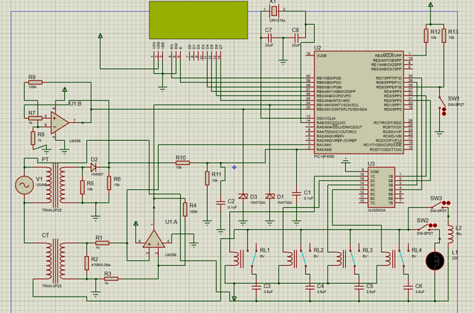
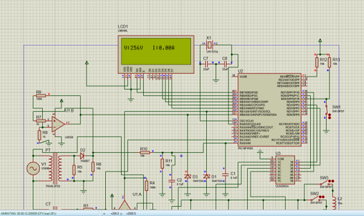
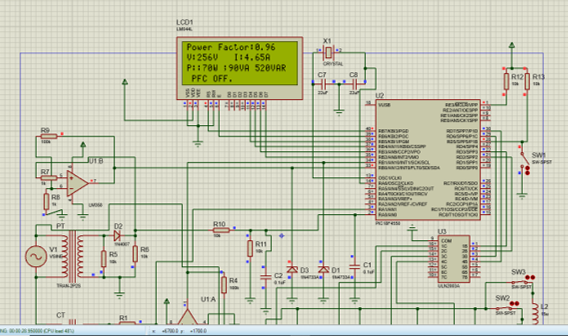
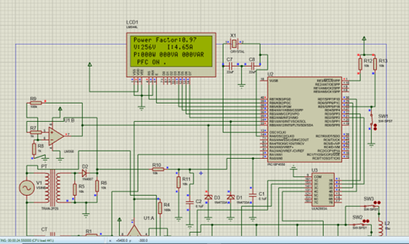

# Microcontroller-based Automatic Power Factor Improvement

## Overview
This project demonstrates a microcontroller-based system for automatic power factor correction (PFC). It achieves unity power factor by dynamically switching capacitors into the circuit. The system is low-cost, efficient, and uses widely available electronic components.

## Features
- **Automatic Detection and Correction**: Uses a PIC18F4550 microcontroller to monitor and improve power factor.
- **Real-time Monitoring**: Incorporates sensors for voltage and current measurement.
- **Dynamic Capacitor Adjustment**: Relays are controlled to add or remove capacitors based on the load's power factor.

## Project Components
- **Microcontroller**: PIC18F4550 for logic and control.
- **Sensors**:
  - Current Transformer (CT)
  - Potential Transformer (PT)
- **Relay Driver IC**: ULN2003A for controlling relays.
- **Passive Components**: Capacitors, resistors, and inductors for reactive power compensation.
- **Output Interface**: LCD to display voltage, current, and power factor.

## Circuit Diagram
*The system integrates current and voltage transformers to measure parameters. These signals are processed by the microcontroller, which dynamically adjusts capacitors through relays.*

**Working Principle:**
- **Step 1**: Voltage and current are sensed using CT and PT.
- **Step 2**: Signals are converted into a usable format for the microcontroller.
- **Step 3**: The microcontroller calculates the power factor and decides the necessary compensation.
- **Step 4**: Relays switch capacitors in or out of the circuit to achieve optimal power factor.

Below is the circuit diagram used for the power factor improvement system:

## Benefits
- Avoids power factor penalties imposed by utilities.
- Improves voltage regulation.
- Reduces demand charges and power losses.
- Increases circuit load capacity without costly upgrades.

## Implementation Steps
1. Assemble the circuit as per the schematic.
2. Flash the microcontroller with the provided `MyProject.c`, `MyProject.hex` and `Pfi_improvment.pdsprj` code in the `Source` folder.
3. Connect the CT, PT, relays, and capacitors as specified.
4. Power on the system and monitor the LCD for real-time performance.

## Outputs
The system provides three primary outputs:
1. **No Load**: Displays no corrections are applied.
2. **PFC Off**: Shows when capacitors are inactive.
3. **PFC On**: Indicates active power factor correction.

### No Load
The system displays "No Load" when there is no active load connected:

### PFC Off
When power factor correction is off, the system displays:

### PFC On
When power factor correction is active, the system adjusts the capacitors dynamically and displays:

## Advantages and Applications
- Suitable for industrial and commercial setups with inductive loads.
- Prevents utility penalties by maintaining a high power factor.
- Can be adapted for three-phase systems as future work.

## Future Improvements
- Reduce switching losses in relays.
- Adapt the design for three-phase power systems.
